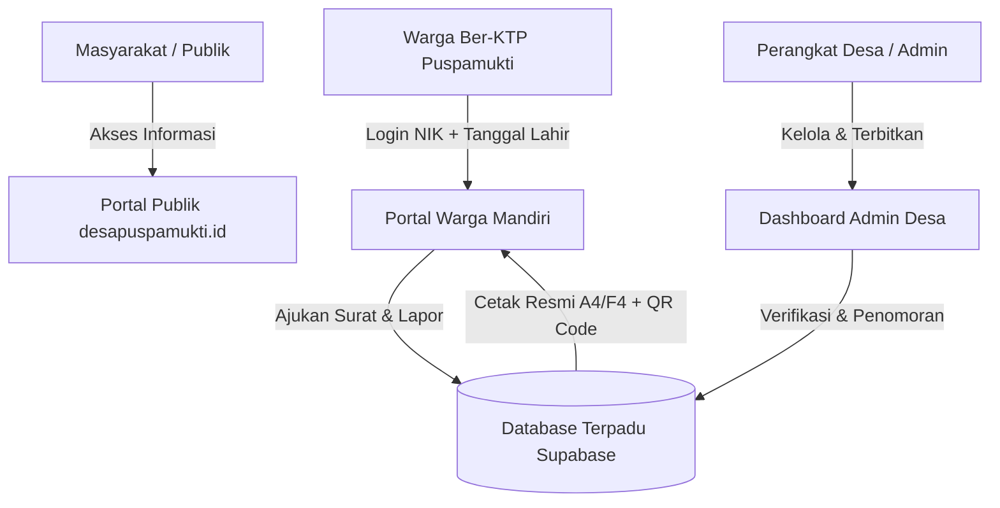

# 📖 BUKU PANDUAN PENGGUNAAN & TATA KELOLA OPERASIONAL
## Website Resmi & Sistem E-Government Terpadu Desa Puspamukti
**Kecamatan Cigalontang, Kabupaten Tasikmalaya, Jawa Barat**

---

> [!NOTE]
> **Dokumen Resmi Serah Terima Hasil Program Kuliah Kerja Nyata (KKN)**  
> **Universitas Perjuangan Tasikmalaya (UNPER) Tahun 2026**  
> *Ditujukan Kepada: Pemerintah Desa Puspamukti & Seluruh Warga Masyarakat*

---

## DAFTAR ISI
1. [Tentang Sistem E-Government Desa Puspamukti](#1-tentang-sistem-e-government-desa-puspamukti)
2. [Panduan Portal Warga (Layanan Mandiri Masyarakat)](#2-panduan-portal-warga-layanan-mandiri-masyarakat)
   - 2.1. Cara Masuk / Login Portal Warga
   - 2.2. Pengecekan Data Diri & Status Bantuan Sosial (Bansos)
   - 2.3. Pengajuan Permohonan Surat Online
   - 2.4. Pencetakan & Unduh Surat Resmi (A4 & F4)
   - 2.5. Layanan Aspirasi & Pengaduan (Lapor Kades)
3. [Panduan Portal Admin Desa (Khusus Perangkat & Staf Balai Desa)](#3-panduan-portal-admin-desa-khusus-perangkat--staf-balai-desa)
   - 3.1. Akses Masuk Admin Desa
   - 3.2. Verifikasi, Penomoran, & Penerbitan E-Surat
   - 3.3. Pelayanan Surat Manual (Loket Fisik / Walk-in)
   - 3.4. Pengelolaan Pengaduan Warga (Aspirasi)
   - 3.5. Pembaruan Transparansi Anggaran (APBDes)
   - 3.6. Manajemen Berita, Galeri Kegiatan, & Agenda Desa
   - 3.7. Pengelolaan Produk & Unit Usaha BUMDes
4. [Struktur Kode Penomoran Surat Desa](#4-struktur-kode-penomoran-surat-desa)
5. [Spesifikasi Teknis & Panduan Pemeliharaan (Maintenance)](#5-spesifikasi-teknis--panduan-pemeliharaan-maintenance)

---

## 1. Tentang Sistem E-Government Desa Puspamukti

Website resmi Desa Puspamukti dibangun sebagai platform terpadu untuk mewujudkan **Keterbukaan Informasi Publik (KIP)**, **Pelayanan Administrasi Kependudukan Cepat**, dan **Transparansi Tata Kelola Keuangan Desa**.



---

## 2. Panduan Portal Warga (Layanan Mandiri Masyarakat)

Portal Warga dirancang agar warga Desa Puspamukti dapat mengurus kebutuhan administrasi langsung dari rumah atau telepon pintar (HP) tanpa perlu mengantre lama di kantor desa.

### 2.1. Cara Masuk / Login Portal Warga
1. Kunjungi tautan: **`desapuspamukti.id/warga/login`** (atau klik menu **"Portal Warga"** di navbar utama).
2. Masukkan **16 Digit NIK** (Nomor Induk Kependudukan yang tertera di KTP/KK).
3. Masukkan **Tanggal Lahir** (format: `DD/MM/YYYY`).
4. Klik tombol **"Masuk ke Portal Warga"**.
5. Sistem akan memvalidasi data dan langsung membuka Dasbor Layanan Mandiri Anda.

---

### 2.2. Pengecekan Data Diri & Status Bantuan Sosial (Bansos)
* Pada tab **"Status Bansos & Data Diri"**, warga dapat melihat data kependudukan (NIK disamarkan demi privasi, RT/RW, dan status pembayaran PBB-P2).
* Warga dapat memeriksa status penerima bantuan pemerintah, seperti:
  * Program Keluarga Harapan (PKH)
  * Bantuan Pangan Non-Tunai (BPNT / Sembako)
  * Bantuan Langsung Tunai Dana Desa (BLT-DD)
  * Kartu Indonesia Sehat (KIS / PBI-JK)

---

### 2.3. Pengajuan Permohonan Surat Online
1. Pilih tab **"Layanan E-Surat Mandiri"**.
2. Klik jenis surat yang dibutuhkan:
   * **Surat Keterangan Tidak Mampu (SKTM)** *(Keperluan Beasiswa / Keringanan Biaya)*
   * **Surat Keterangan Usaha (SKU)** *(Keperluan Pengajuan KUR / Modal Usaha)*
   * **Surat Pengantar Domisili**
   * **Surat Pengantar SKCK** *(Keperluan Melamar Pekerjaan)*
   * **Surat Keterangan Belum Menikah**
3. Masukkan **Keperluan Surat** secara jelas (contoh: *"Persyaratan Beasiswa Pendidikan Anak ke SMAN 1"*).
4. Tambahkan catatan tambahan jika diperlukan (contoh: *"Nama Usaha: Toko Sembako Berkah"*).
5. Klik **"Kirim Permohonan Surat"**.
6. Status permohonan akan tercatat sebagai **"Menunggu Persetujuan"** dan dapat dipantau langsung pada tabel riwayat di bagian bawah halaman.

---

### 2.4. Pencetakan & Unduh Surat Resmi (A4 & F4)
1. Setelah permohonan disetujui oleh perangkat desa, status akan berubah menjadi **"Disetujui"** dengan nomor register resmi yang sudah tertera.
2. Klik tombol hijau **`[ Cetak Surat ]`**.
3. Jendela pratinjau surat resmi akan terbuka lengkap dengan Kop Surat Resmi, Identitas, dan QR Code verifikasi digital.
4. **Pilih Ukuran Kertas:**
   * Klik tombol **`📄 A4 (210 × 297 mm)`** jika menggunakan kertas standar A4.
   * Klik tombol **`📄 F4 / Folio (215 × 330 mm)`** jika menggunakan kertas panjang Folio.
5. Klik **"Cetak / Simpan PDF"** $\rightarrow$ Simpan file PDF di HP atau cetak langsung menggunakan printer.

---

### 2.5. Layanan Aspirasi & Pengaduan (Lapor Kades)
1. Pilih tab **"Lapor Kades (Aspirasi)"**.
2. Pilih kategori laporan (*Infrastruktur Jalan, Pelayanan Desa, Bansos, Keamanan, atau Lainnya*).
3. Tuliskan isi laporan, saran, atau aduan secara santun dan jelas.
4. Klik **"Kirim Laporan ke Kades"**.
5. Warga dapat memantau status penanganan aduan (*Belum Diproses, Sedang Diproses, atau Selesai*) pada tabel di samping formulir.

---

## 3. Panduan Portal Admin Desa (Khusus Perangkat & Staf Balai Desa)

Portal Admin adalah ruang kerja digital perangkat desa untuk memproses surat warga, mempublikasikan berita, dan memperbarui data desa.

### 3.1. Akses Masuk Admin Desa
* Tautan Admin: **`desapuspamukti.id/admin/login`**
* Masukkan Username & Password resmi admin desa.

---

### 3.2. Verifikasi, Penomoran, & Penerbitan E-Surat
1. Buka menu **"Layanan & Aspirasi" $\rightarrow$ "Permohonan E-Surat"** (`/admin/surat`).
2. Tabel menampilkan seluruh permohonan surat masuk dari warga secara urut waktu.
3. Pada baris surat warga yang ingin diproses, klik tombol biru **`[ ⚙️ Beri Nomor / Edit ]`**.
4. Di dalam jendela modal:
   * Periksa rincian data pemohon dan keperluannya.
   * Ubah status menjadi **"Disetujui"**.
   * **Beri Nomor Surat:**
     * Ketik manual nomor surat sesuai buku register fisik kantor desa (contoh: `470/025/Pemdes/2026`).
     * *Atau* klik tombol **`[ ⚡ Buat No. Otomatis ]`** untuk meminta sistem membuat nomor urut otomatis.
   * Tambahkan catatan admin bila ada (opsional).
5. Klik **"Simpan & Terbitkan"**.
6. Klik tombol hijau **`[ 🖨️ Cetak ]`** untuk langsung mencetak dokumen fisik dengan pilihan kertas **A4** atau **F4**.

---

### 3.3. Pelayanan Surat Manual (Loket Fisik / Walk-in)
Untuk warga lansia atau warga yang datang langsung ke Balai Desa tanpa membawa ponsel pintar:
1. Pada halaman `/admin/surat`, klik tombol **`[ ➕ Buat Surat Manual (Loket Desa) ]`** di kanan atas.
2. Isi Nama Warga, NIK (16 Digit), RT/RW, Jenis Surat, Keperluan, dan Nomor Register Surat.
3. Klik **"Terbitkan Surat"**.
4. Dokumen surat langsung masuk ke arsip digital desa dan siap dicetak dalam hitungan detik.

---

### 3.4. Pengelolaan Pengaduan Warga (Aspirasi)
1. Buka menu **"Pengaduan Warga"** (`/admin/pengaduan`).
2. Admin dapat membaca seluruh aduan masuk dari portal warga maupun formulir publik.
3. Ubah status penanganan laporan menjadi **"Sedang Diproses"** atau **"Selesai"** setelah ditindaklanjuti di lapangan.

---

### 3.5. Pembaruan Transparansi Anggaran (APBDes)
1. Buka menu **"Transparansi Anggaran"** (`/admin/transparansi`).
2. Masukkan rincian pos anggaran:
   * **Tahun Anggaran:** (Contoh: `2026`)
   * **Pendapatan Desa:** (PADes, Dana Desa, Bagi Hasil Pajak, Bantuan Provinsi)
   * **Belanja Desa:** (Penyelenggaraan Pemerintahan, Pembangunan Fisik, Pembinaan, Pemberdayaan, Penanggulangan Bencana)
3. Angka persentase realisasi dan sisa anggaran (SILPA) akan dihitung secara otomatis oleh sistem grafik publik.

---

### 3.6. Manajemen Berita, Galeri Kegiatan, & Agenda Desa
1. Buka menu **"Berita & Informasi"** (`/admin/berita`).
2. Klik **"Tambah Berita Baru"** $\rightarrow$ Masukkan judul berita, kategori (*Pembangunan, Kegiatan Warga, Kesehatan, dll*), tanggal, ringkasan, isi lengkap, dan unggah foto dokumentasi.
3. Berita yang disimpan akan langsung terbit di halaman publik dan carousel beranda utama.

---

### 3.7. Pengelolaan Produk & Unit Usaha BUMDes
1. Buka menu **"Katalog BUMDes"** (`/admin/bumdes`).
2. Masukkan nama unit usaha (misal: *Unit Agribisnis & Penggilingan Beras, Unit Perdagangan Saprotan, Unit Pengelolaan Sampah Mandiri*).
3. Tuliskan deskripsi operasional, layanan yang ditawarkan, nomor kontak penanggung jawab unit, dan status operasional aktif.

---

## 4. Struktur Kode Penomoran Surat Desa

Sesuai dengan standar Permendagri tentang Tata Naskah Dinas Pemerintahan Desa:

| Jenis Pelayanan Administrasi | Format Kode Klasifikasi | Contoh Nomor Surat |
|---|---|---|
| **Surat Keterangan Kependudukan / Umum** (SKTM, Domisili, Belum Menikah, Pengantar SKCK) | `470 / [Nomor Urut] / Pemdes / [Tahun]` | `470/015/Pemdes/2026` |
| **Surat Keterangan Usaha / Ekonomi** (SKU, Keterangan Penghasilan, Kemitraan Tani) | `500 / [Nomor Urut] / Pemdes / [Tahun]` | `500/008/Pemdes/2026` |
| **Surat Pelayanan Digital / Online Mandiri** *(Opsional)* | `470 / [Nomor Urut] / Pemdes.Online / [Tahun]` | `470/003/Pemdes.Online/2026` |

---

## 5. Spesifikasi Teknis & Panduan Pemeliharaan (Maintenance)

### 5.1. Teknologi yang Digunakan
* **Frontend Framework:** Astro v5 (Ultra-fast, Zero JS runtime default, SEO Optimized)
* **Styling & UI:** Tailwind CSS v4 + Radix UI + Lucide Icons
* **Database & Cloud Backend:** Supabase (PostgreSQL Enterprise Cloud with Realtime & Row Level Security)
* **Penyimpanan Gambar & Berkas:** Supabase Cloud Storage Buckets
* **Arsitektur Cetak:** Native CSS `@media print` with Dynamic `@page` (Support A4: 210x297mm & F4: 215x330mm)
* **Mode Ketahanan Offline:** Hybrid Storage Cache (`localStorage` Auto-Fallback)

---

### 5.2. Struktur Database Supabase Utama

```
📁 Supabase PostgreSQL Tables:
 ├── 📄 aparatur           (Struktur Organisasi & Perangkat Desa)
 ├── 📄 berita             (Publikasi Berita, Kegiatan & Pengumuman)
 ├── 📄 agenda             (Kalender Kegiatan Balai Desa)
 ├── 📄 permohonan_surat   (Layanan E-Surat Mandiri & Cetak A4/F4)
 ├── 📄 pengaduan          (Layanan Aspirasi & Lapor Kades)
 ├── 📄 transparansi       (Pos Anggaran APBDes & Realisasi Belanja)
 ├── 📄 bumdes             (Unit Usaha & Produk Ekonomi Desa)
 ├── 📄 regulasi           (Peraturan Desa & SK Kepala Desa)
 ├── 📄 wisata             (Objek Wisata, Edukasi & Potensi Desa)
 └── 📄 bencana            (Informasi Siaga, Posko & Titik Kumpul)
```

---

> [!TIP]
> **Kontak Bantuan Pengembang:**  
> Jika memerlukan bantuan teknis lanjutan, penyesuaian domain, atau penambahan data master, silakan menghubungi Tim KKN UNPER Desa Puspamukti melalui kontak yang tertera pada halaman **`/tim-kkn`**.

---
*Dokumen ini disusun pada tanggal 01 September 2026 oleh Tim KKN Universitas Perjuangan Tasikmalaya untuk Pemerintah Desa Puspamukti.*
